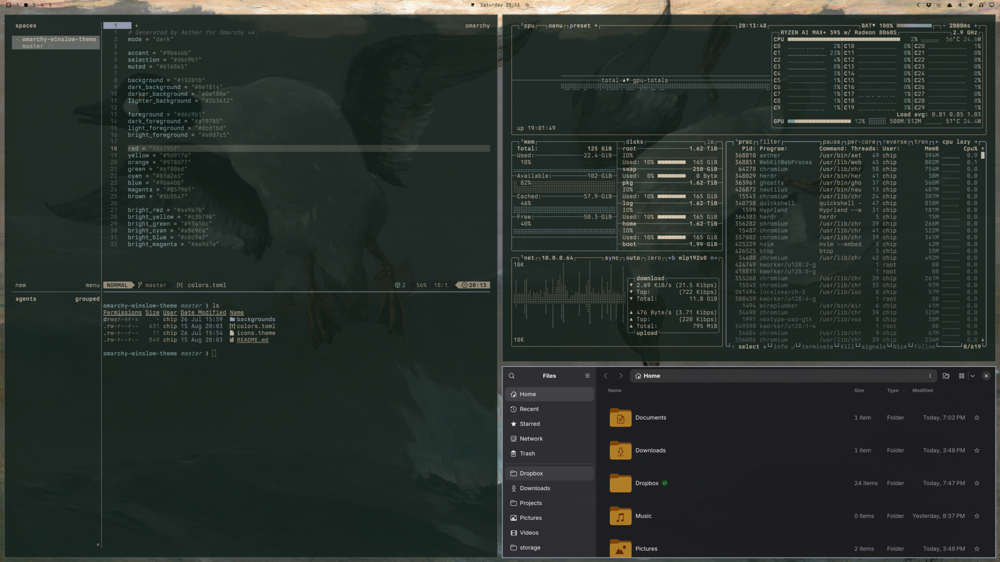

# Winslow Theme

“The sun will not rise or set without my notice and thanks.” — Winslow Homer

A dark, calm [Omarchy](https://omarchy.org/) theme inspired by Winslow Homer’s seascapes: muted
ocean, sand, and dusk tones for a quiet desktop.




## Install

```bash
omarchy theme install https://github.com/chipkoziara/omarchy-winslow-theme
```

## Palette

| Role | Hex |
| --- | --- |
| Background | `#13201b` |
| Dark background | `#0e1814` |
| Darker background | `#0a100e` |
| Lighter background | `#2b3632` |
| Foreground | `#d6c9b1` |
| Accent | `#9ba4bb` |
| Selection | `#d6c9b1` |
| Muted | `#616865` |

Full ANSI palette in [`colors.toml`](colors.toml). Icons are `Yaru-yellow`.

Five public-domain Winslow Homer paintings are included in [`backgrounds/`](backgrounds/).
